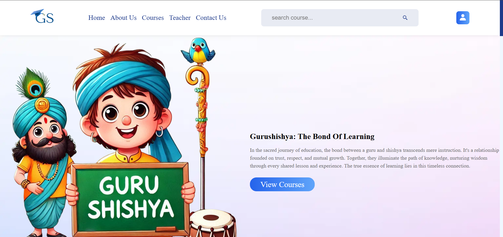
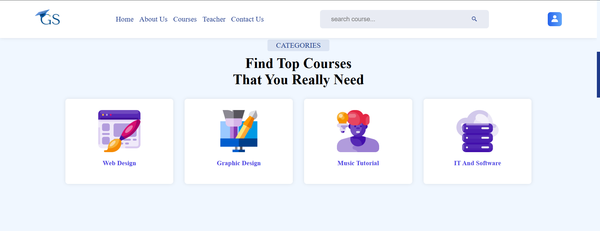
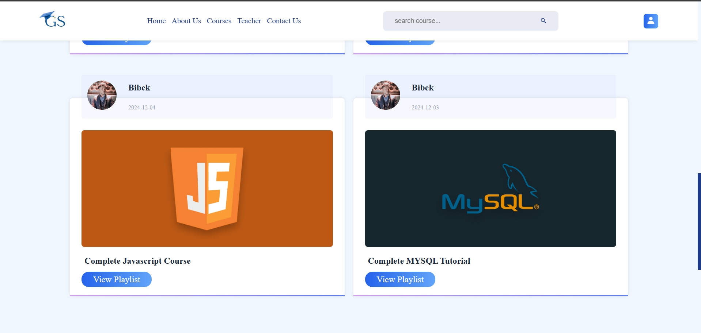
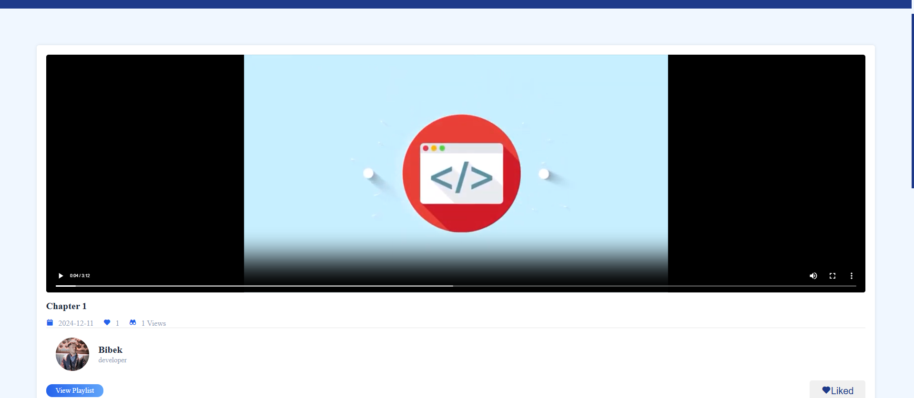
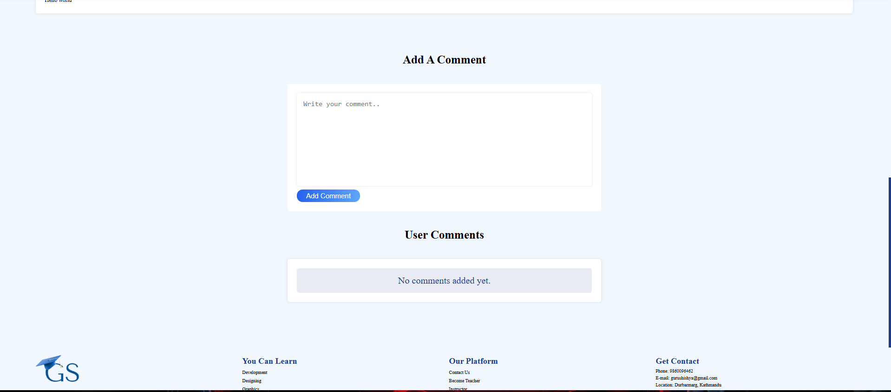
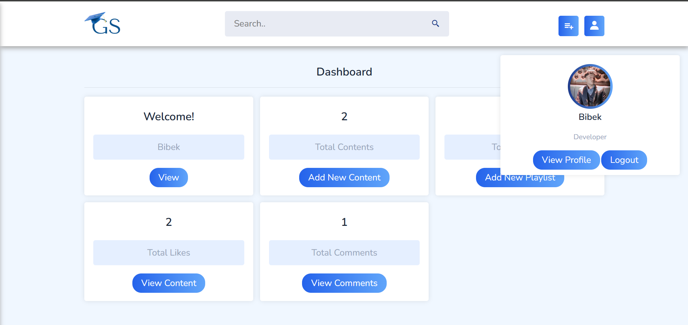
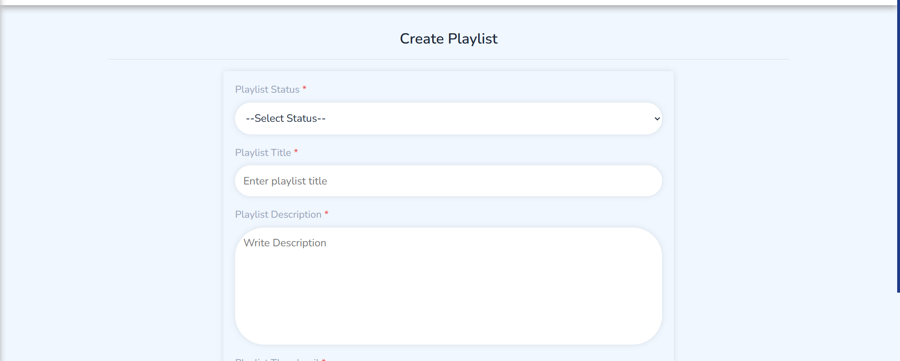

# ELEARNING-PLATFORM
GuruShishya is a free, web-based e-learning platform designed to connect instructors and learners in a structured online environment. It facilitates course management, student engagement, and interactive learning experiences, ensuring that everyone can access quality education. 

💻 Tech Stack:
✅ Frontend: HTML, CSS, JavaScript,
✅ Backend: PHP, SQL 
✅ Tools & Libraries: SweetAlert, Boxicons

You can read proper document from above repository.

